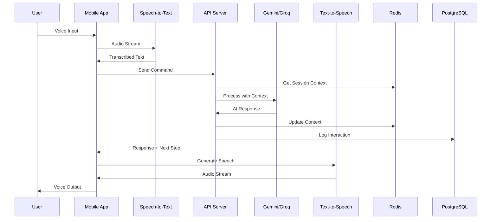
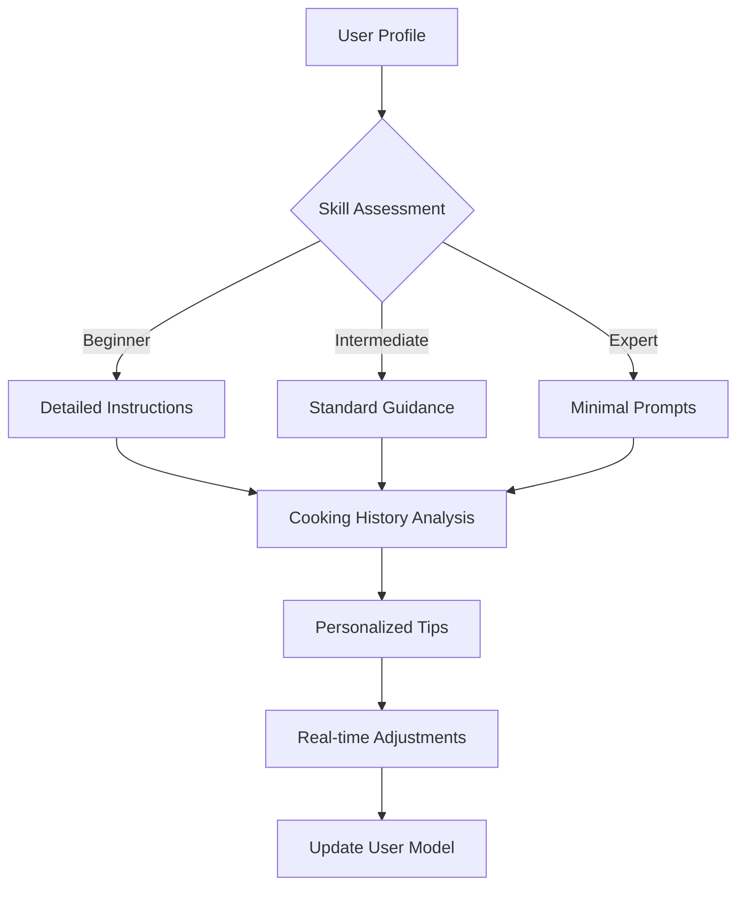
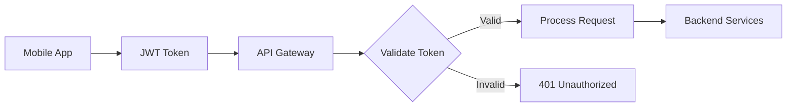

# CookMate AI Coach - System Architecture

## 1. System Overview

The CookMate AI Coach is a distributed system consisting of:
- React Native mobile application (iOS/Android)
- Node.js backend API server
- AI/ML services for conversation and voice processing
- Redis for session management
- PostgreSQL for persistent storage

## 2. Component Architecture

### 2.1 Mobile Application Layer

```
┌─────────────────────────────────────────────┐
│          React Native Mobile App            │
├─────────────────────────────────────────────┤
│  ┌─────────────┐  ┌──────────────────────┐ │
│  │ Voice UI    │  │ Recipe Walkthrough   │ │
│  │ Components  │  │ Components           │ │
│  └─────────────┘  └──────────────────────┘ │
│  ┌─────────────┐  ┌──────────────────────┐ │
│  │ Audio       │  │ State Management     │ │
│  │ Services    │  │ (Redux/Context)      │ │
│  └─────────────┘  └──────────────────────┘ │
└─────────────────────────────────────────────┘
```

### 2.2 Backend Services Architecture

```
┌─────────────────────────────────────────────┐
│            API Gateway (Express)            │
├─────────────────────────────────────────────┤
│  ┌─────────────┐  ┌──────────────────────┐ │
│  │ Auth        │  │ Recipe Management    │ │
│  │ Middleware  │  │ Service              │ │
│  └─────────────┘  └──────────────────────┘ │
│  ┌─────────────┐  ┌──────────────────────┐ │
│  │ Session     │  │ Coaching Engine      │ │
│  │ Manager     │  │ Service              │ │
│  └─────────────┘  └──────────────────────┘ │
└─────────────────────────────────────────────┘
```

### 2.3 AI/ML Services Integration

```
┌─────────────────────────────────────────────┐
│           AI Services Layer                 │
├─────────────────────────────────────────────┤
│  ┌─────────────┐  ┌──────────────────────┐ │
│  │ Gemini/Groq │  │ Speech-to-Text       │ │
│  │ LLM API     │  │ (Google/Vosk)        │ │
│  └─────────────┘  └──────────────────────┘ │
│  ┌─────────────┐  ┌──────────────────────┐ │
│  │ Text-to-    │  │ Context Memory       │ │
│  │ Speech API  │  │ Manager              │ │
│  └─────────────┘  └──────────────────────┘ │
└─────────────────────────────────────────────┘
```

## 3. Data Flow Architecture

### 3.1 Voice Interaction Flow



### 3.2 Adaptive Coaching Flow



## 4. Database Schema

### 4.1 PostgreSQL Tables

```sql
-- Users table
CREATE TABLE users (
    id UUID PRIMARY KEY,
    email VARCHAR(255) UNIQUE NOT NULL,
    name VARCHAR(255),
    skill_level ENUM('beginner', 'intermediate', 'expert'),
    preferences JSONB,
    created_at TIMESTAMP DEFAULT NOW(),
    updated_at TIMESTAMP DEFAULT NOW()
);

-- Cooking Sessions
CREATE TABLE cooking_sessions (
    id UUID PRIMARY KEY,
    user_id UUID REFERENCES users(id),
    recipe_id UUID,
    started_at TIMESTAMP DEFAULT NOW(),
    completed_at TIMESTAMP,
    duration INTEGER,
    feedback JSONB,
    skill_improvements JSONB
);

-- User Progress
CREATE TABLE user_progress (
    id UUID PRIMARY KEY,
    user_id UUID REFERENCES users(id),
    recipe_id UUID,
    completion_count INTEGER DEFAULT 0,
    average_time INTEGER,
    last_cooked TIMESTAMP,
    mastery_level INTEGER DEFAULT 0
);

-- Coaching Interactions
CREATE TABLE coaching_interactions (
    id UUID PRIMARY KEY,
    session_id UUID REFERENCES cooking_sessions(id),
    timestamp TIMESTAMP DEFAULT NOW(),
    user_input TEXT,
    coach_response TEXT,
    interaction_type VARCHAR(50),
    context JSONB
);
```

### 4.2 Redis Session Schema

```javascript
// Session Context Structure
{
  "sessionId": "uuid",
  "userId": "uuid",
  "recipeId": "uuid",
  "currentStep": 3,
  "totalSteps": 10,
  "startTime": "2025-01-27T10:00:00Z",
  "context": {
    "skillLevel": "intermediate",
    "pace": "normal",
    "lastInteraction": "2025-01-27T10:05:00Z",
    "questionsAsked": ["substitution", "timing"],
    "tipsProvided": ["knife_technique", "heat_control"]
  },
  "timers": [
    {
      "id": "timer1",
      "duration": 300,
      "remaining": 120,
      "description": "Simmer sauce"
    }
  ]
}
```

## 5. API Endpoints

### 5.1 Core Endpoints

```yaml
# Session Management
POST   /api/sessions/start
GET    /api/sessions/:id
PUT    /api/sessions/:id/update
DELETE /api/sessions/:id/end

# Voice Interaction
POST   /api/voice/process
POST   /api/voice/transcribe
GET    /api/voice/synthesize/:text

# Coaching
POST   /api/coach/ask
GET    /api/coach/tips/:recipeId/:step
POST   /api/coach/feedback

# User Management
GET    /api/users/:id/profile
PUT    /api/users/:id/preferences
GET    /api/users/:id/progress
```

## 6. Security Architecture

### 6.1 Authentication Flow



### 6.2 Security Measures

- **API Authentication**: JWT tokens with refresh mechanism
- **Data Encryption**: TLS 1.3 for all API communications
- **Voice Data**: Encrypted audio streams, no permanent storage
- **PII Protection**: User data anonymization and GDPR compliance
- **Rate Limiting**: API request throttling per user
- **Input Validation**: Sanitization of all user inputs

## 7. Scalability Considerations

### 7.1 Horizontal Scaling

- **Load Balancer**: Distribute traffic across multiple API servers
- **Redis Cluster**: Session management across multiple nodes
- **Database Replication**: Read replicas for PostgreSQL
- **CDN**: Static asset delivery for mobile app

### 7.2 Performance Optimization

- **Caching Strategy**: Redis for frequently accessed data
- **Audio Streaming**: WebRTC for low-latency voice
- **Batch Processing**: Aggregate analytics and user progress
- **Connection Pooling**: Optimize database connections

## 8. Monitoring & Observability

### 8.1 Key Metrics

- **API Response Time**: < 200ms p95
- **Voice Recognition Accuracy**: > 95%
- **Session Completion Rate**: Track user engagement
- **Error Rate**: < 0.1% for critical paths

### 8.2 Logging Strategy

```javascript
// Structured logging format
{
  "timestamp": "2025-01-27T10:00:00Z",
  "level": "info",
  "service": "coaching-engine",
  "userId": "uuid",
  "sessionId": "uuid",
  "event": "step_completed",
  "metadata": {
    "recipeId": "uuid",
    "stepNumber": 3,
    "duration": 120
  }
}
```

## 9. Deployment Architecture

### 9.1 Container Strategy

```yaml
# Docker Compose Overview
services:
  api:
    image: cookmate-api:latest
    replicas: 3
    
  redis:
    image: redis:7-alpine
    
  postgres:
    image: postgres:14
    
  nginx:
    image: nginx:alpine
    # Load balancer configuration
```

### 9.2 CI/CD Pipeline

1. **Code Push** → GitHub/GitLab
2. **Automated Tests** → Jest, Detox
3. **Build** → Docker images
4. **Deploy** → Kubernetes/ECS
5. **Health Checks** → Automated monitoring

## 10. Future Enhancements

- **Computer Vision**: Camera integration for cooking progress
- **Multi-language Support**: Internationalization
- **Offline Mode**: Local LLM for basic functionality
- **Social Features**: Share cooking sessions
- **AR Integration**: Visual overlays for techniques
